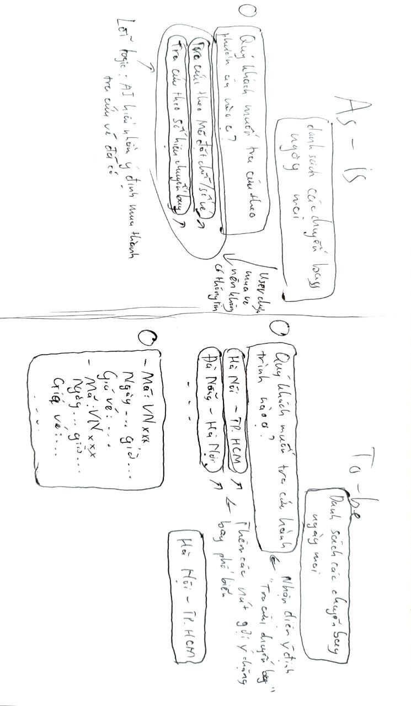

# UX exercise - Vietnam Airlines — Chatbot NEO (Chatbot hỗ trợ khách hàng, tra cứu chuyến bay)

## Sản phẩm: Vietnam Airlines — Chatbot NEO (Chatbot hỗ trợ khách hàng, tra cứu chuyến bay)

## 4 paths

### 1. AI đúng
- User hỏi: "Chuyến bay VN123 ngày mai mấy giờ bay?"
- NEO nhận diện đúng mã chuyến bay + ngày khởi hành → Trả về thẻ (Card) thông tin giờ đi/đến chính xác.
- UI: Hiện Card thông tin chi tiết, có nút "Làm thủ tục ngay".

### 2. AI không chắc
- User hỏi: "Hành lý sao em?" (Câu hỏi mơ hồ).
- NEO tự mặc định user đang hỏi về "Hành lý thất lạc" thay vì đưa ra các lựa chọn (Cân nặng, Quy định chất lỏng, Mất đồ).
- Vấn đề: AI dùng cơ chế Assumption (tự giả định) thay vì Clarification (hỏi lại cho rõ). User muốn xem quy định cân nặng phải tốn thêm bước thoát ra hỏi lại.

### 3. AI sai
- User hỏi: "Danh sách các chuyến bay ngày mai".
- NEO không liệt kê được danh sách mà lại hiện nút: "Vui lòng nhập mã chuyến bay".
- Sửa: User thử gõ tên thành phố hoặc đổi cách hỏi nhưng AI vẫn lặp lại yêu cầu nhập mã chuyến bay.
- Vấn đề: Vòng lặp chết (Dead-end loop). AI không có fallback sang tìm kiếm theo chặng bay khi không có mã cụ thể.

### 4. User mất niềm tin
- User hỏi: "Giá vé VN213 ngày mai".
- NEO có Exit path rất rõ: Ngay lập tức hiện hotline và nút "Gặp tư vấn viên".
- NEO luôn báo không có thông tin và đưa hotline cùng nút "Gặp tư vấn viên" cho đến khi liên hệ tư vấn viên để nhận được kết quả.

## Path yếu nhất: Path 2 + 3
- Khi thông tin đầu vào mơ hồ, AI chọn bừa một kết quả thay vì gợi ý menu lựa chọn.
- Recovery flow của Path 3 cực kỳ kém: Ép người dùng cung cấp dữ liệu mà họ đang đi tìm (mã chuyến bay), tạo ra trải nghiệm gây ức chế.

## Gap marketing vs thực tế
- Marketing: "Trợ lý ảo thông minh hiểu ngôn ngữ tự nhiên", "Hỗ trợ tìm kiếm tình trạng đặt chỗ".
- Thực tế: Bản chất vẫn là Keyword-based (dựa trên từ khóa). Chỉ xử lý tốt các dữ liệu tĩnh (văn bản quy định).
- Gap lớn nhất: Khả năng xử lý dữ liệu động (Dynamic data) và tìm kiếm linh hoạt còn yếu. Marketing khiến user kỳ vọng một "người hỗ trợ" nhưng thực tế chỉ là một "bộ lọc câu hỏi" có sẵn.

## Sketch

- As-is: Tra cứu chuyến bay → Bot hỏi "Quý khách muốn tra cứu theo phương án nào?" (Nút bấm) → User không có thông tin để nhập.
- To-be: Tra cứu chuyến bay → Bot hiện: "Quý khách muốn tra cứu hành trình nào?" → User click chọn → Bot hiện danh sách mã chuyến bay, thời gian và giá vé
